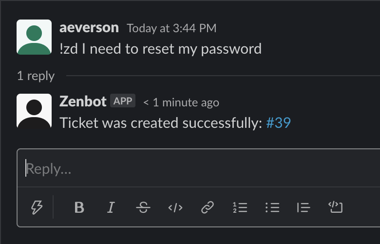
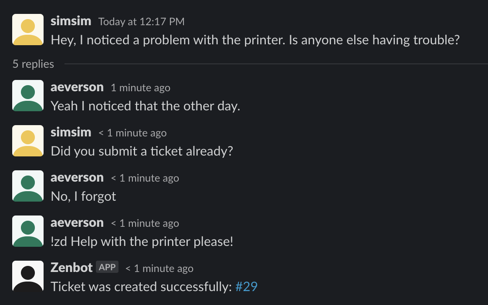
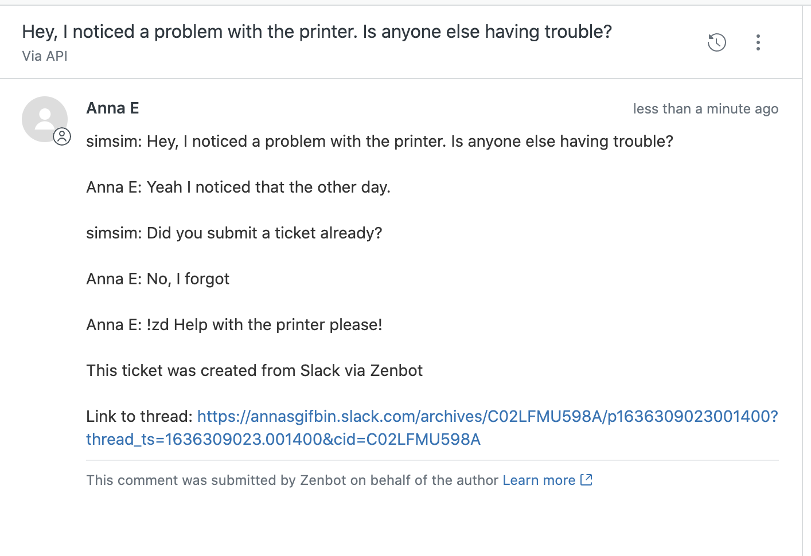

# Anna's Zenbot

Zenbot is a python application that listens in a Slack channel for the keyword "!zd"
If the message containing the keyword is not apart of a thread, Zenbot uses that message's text (excluding the keyword) as the subject to create a Zendesk ticket on behalf of the message's sender.

If the message is a part of a thread, the ticket subject will be the text of the parent comment, and will still be submitted on behalf of the user who used the keyword.

The bot will print the entire thread as the initial comment of the ticket with a link to the Slack thread.

In both scenarios, the bot responds in a thread with either an error message or a success message with the Zendesk ticket number which is linked to the ticket.

Assumptions:
* The users who are creating the tickets have access to the agent interface to view tickets. The bot will still work as expected, but the link output to the ticket will only be accessable by Zendesk agents. Additional funcionality would have to be added to direct the users to the public-facing Help Center (if enabled)
* The Zendesk account must have "Anybody can submit tickets" enabled or have all Slack users provisioned in Zendesk ahead of time.
* Zenbot must be invited to a Slack channel manually 
